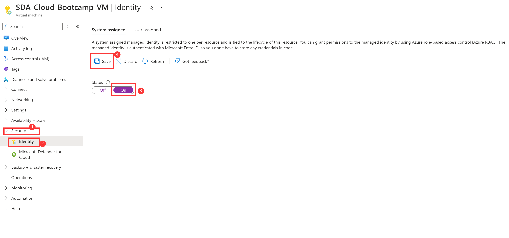
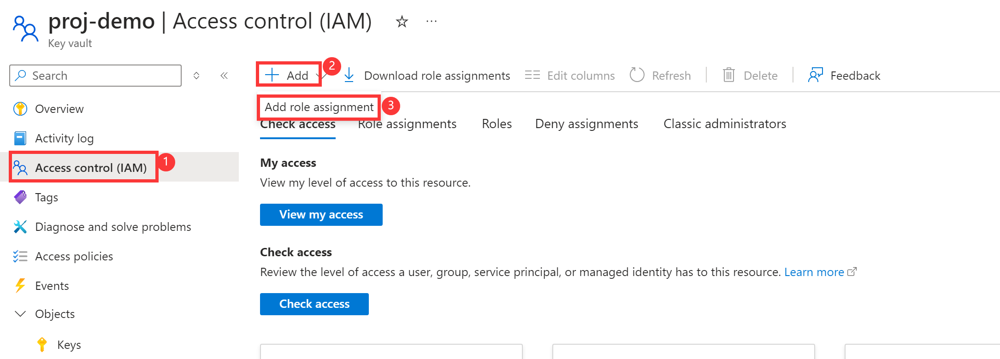
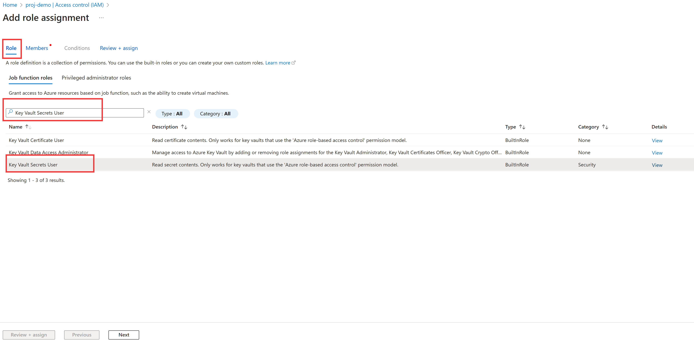
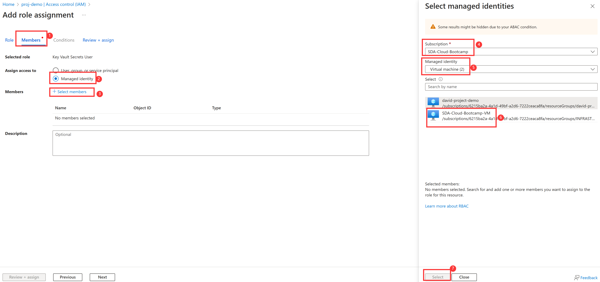
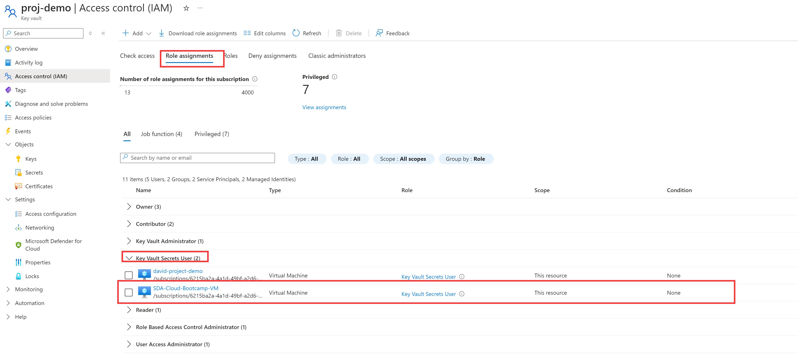

# Grant KeyVault Access To Azure VM

## 1. Set up System Managed Identity for VM
1. Navigate to your Azure VM and click `Security` then `Identity`.

2. In the *System assigned* tab change the status to **ON**, and then click `Save`.

   

## 2. Grant KeyVault Access

1. Navigate to your Azure VM and click `Access control(IAM)`.

2. Click `+Add` and then click `Add role assignment`.

   

3. In the *Role* tab, search and select `Key Vault Secrets User`.

   

4. Switch to the *Members* tab, for the `Assign access to` select `Managed identity`, and then click `+Select members`. Then in the pop-up window, select the **Subscription of your VM**, and then choose **`Virtual machine`** for the `Managed identity`, then click the **name of your VM**. Click `Select` once you selected your VM.

   

5. Finally click the `Review + assign` to finish the assignment.

6. Now in the *Role assignments* tab, you can see that the VM is already have the access. It should be under the *Key Vault Secrets User* section.

   